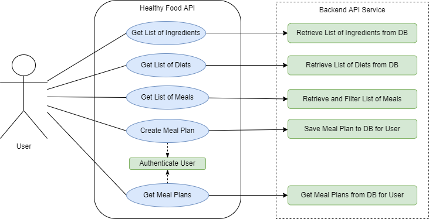
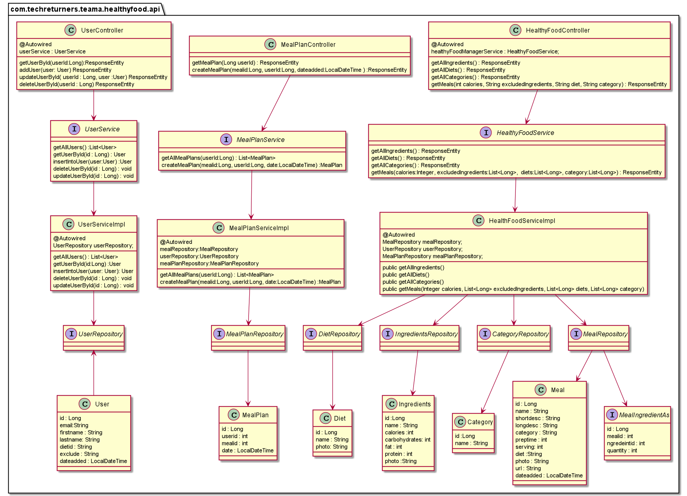
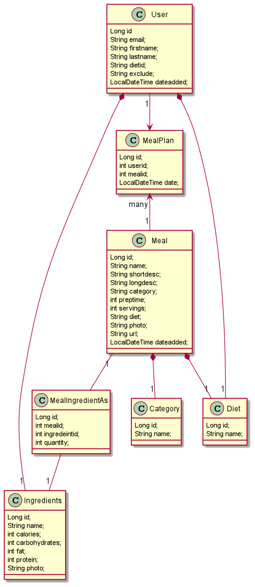

# Healthy Food API
Healthy Food API is designed to create a meal plan for a day based on dietary restrictions. 
The objective of this application is to fetch different meals and let the user add the meals to meal planner.
The meals are based on total amount of calories per day, the type of diet and list of ingredients user wants to exclude from his meals.

* Example of Diet :  vegan, vegetarian, keto, Dairy-free, gluten-free etc
* Example of Exclusion :  nuts, mushrooms, peanut, eggs, fish, shellfish etc

## Research & Analysis
We started with defining what our MVP will be. After doing the initial research ,we came up with the following features for our MVP :

* Get list of ingredients to be used for exclusion list
* Get list of diets (Gluten-free, Dairy-free, Vegetarian,...)
* Get list of meals
* Create meal plan based on meals IDs and a day
* Get meal plan based on user id 
* Decided to store all the data in the backend using MySql database.
* Setup an AWS Database.
* Using Trello for Scrum
* Daily standup at 10 am
* We will use pairing as well as individual tasks.

### User-Case Diagram

This diagram shows the high-level functions and scope of our application.

### Class Diagram to exhibit the flow from Controller to Service and Repository

The classes are designed in MVC pattern
* Controller will have classes related to endpoints. 
* Service will have interfaces to call the CRUD repository methods
* Repository has the interfaces related to CRUD

### Class Diagram for Model

These classes make use of Lombok annotations and JPA
* The MealIngredientAs class will contain all the ingredients for a particular meal.
* We query the MealIngredeientAs excluding the ingredients which matches the Exclusion list.
* The list of Meal will be returned and further we filter it according to the category and diet.
* This list of Meals is sent to the User.
* User can select meals and add them to particular date as a request.
* Now we insert the selected meal and date inside the MealPlan table.
* We retrieve the saved mealPlan according to the userid.

## Endpoints in Controller
* **Get all ingredients :** localhost:8080/api/v1/ingredient
* **Get all diet types :** localhost:8080/api/v1/diet
* **Get all meal for the user:** localhost:8080/api/v1/meal
  * Parameters : calories, String diet,String exclusions String category
* **Get meal Plan for user :** localhost:8080/api/v1/mealPlans
* **create meal plans for the user :** localhost:8080/api/v1/mealPlans
  * Parameters : Long mealId, Long userId, LocalDateTime dateAdded

## API Documentation

The API documentation is automatically generated with Swagger (Open API), you can either view it as JSON or through the UI.

Run the main application and then go to:

- JSON: http://localhost:8080/v3/api-docs
- User Interface: http://localhost:8080/swagger-ui/index.html

## Creating Production Database in MySQL

We created the database in AWS and connected to our application using following steps.

* Create a publicly accessible MySQL DB in AWS with your own user and password.
* Add a MySQL inbound security rule in the VPC where the AWS DB is running if you would like your local machine to access it.
* Update the following properties in the application-prod.properties file:
  * user and password (password should be updated in your environment variable)
  * datasource url
* Connect to MySQL AWS DB and run the following command:
  * create database healthyfood_database;
* Add the following line in the application-prod.properties file:
  * spring.jpa.hibernate.ddl-auto=update
* Generate the database schema by running the application.
* Add data to DB by running the data.sql scripts in the project resources folder.
* Remove the line added in step 5) to avoid any more automatic updates in Production.

### Pre-Requisites
- Java SE Development Kit 11
- Maven

### Technologies & Dependencies
- Spring Boot
- Spring Web
- -Spring Boot Actuator
- Lombok
- Spring Data JPA
- Mokito
- JUnit 5.8.2
- Maven 4.0
- MySql Database
- Swagger

## How to run the application
  * cd to the project root folder in the command line
  * mvn compile
  * mvn exec:java -Dexec.mainClass=HealthyfoodApplication

## Running the Unit tests
* mvn test

## Run as a Docker container
* cd to the project root folder in the command line
* docker build -t healthy-food-api:1.0 .
* docker run -p 8080:8080 healthy-food-api:1.0
* now you can go to: http://localhost:8080/swagger-ui/index.html

To stop container:

* press CTRL + C or
* kill it from another command line by using:
* docker ps (to get the id of the running container)
* docker stop <container id>
