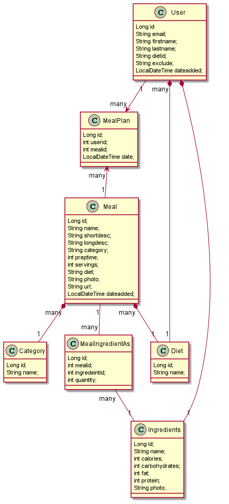
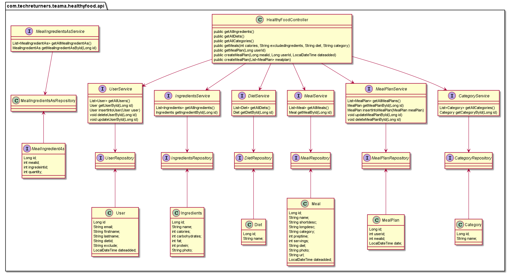

# Healthy Food API
Healthy Food API is designed to create a meal plan for a day based on dietary restrictions. 
The objective of this application is to fetch different meals and let the user add the meals to meal planner.
The meals are based on total amount of calories per day, the type of diet and list of ingredients user wants to exclude from his meals.

* Example of Diet :  vegan, vegetarian, keto, Dairy-free, gluten-free etc
* Example of Exclusion :  nuts, mushrooms, peanut, eggs, fish, shellfish etc

## Endpoints 
* **Get all ingredients :** localhost:8080/api/v1/ingredient
* **Get all diet types :** localhost:8080/api/v1/diet
* **Get all meal for the user:** localhost:8080/api/v1/meal
  * Parameters :
    * calories 
    * diet 
    * exclusions
    * category
* **Get meal Plan for user :** localhost:8080/api/v1/mealPlans
* **create meal plans for the user :** localhost:8080/api/v1/mealPlan
  * Parameters :
    * mealId
    * userId
    * dateAdded

### Class Diagram for Model Classes

These classes are based to the database schema. The database is created in MySql. These classes make user of Lombok annotations and JPA

### Class Diagram to exhibit the flow of Controller to Service and Repository

The classes are designed in MVC pattern
* Controller will have classes related to endpoints. 
* Service will have interfaces to call the CRUD repository methods
* Repository has the interfaces related to CRUD

### Pre-Requisites
- Java SE Development Kit 11
- Maven

### Technologies & Dependencies
- Spring Boot
- Spring Web
- Lombok
- Spring Data JPA
- Mokito
- JUnit 5.8.2
- Maven 4.0
- MySql Database
- Swagger

## API Documentation

The API documentation is automatically generated with Swagger (Open API), you can either view it as JSON or through the UI.

Run the main application and then go to:

- JSON: http://localhost:8080/v3/api-docs
- User Interface: http://localhost:8080/swagger-ui/index.html

## Future Considerations

## How to run the application
  * cd to the project root folder in the command line
  * mvn compile
  * mvn exec:java -Dexec.mainClass=ateam.techreturners.healthyfood.HealthyfoodApplication

## Running the Unit tests
* mvn test
